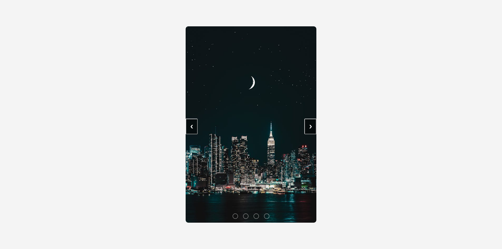
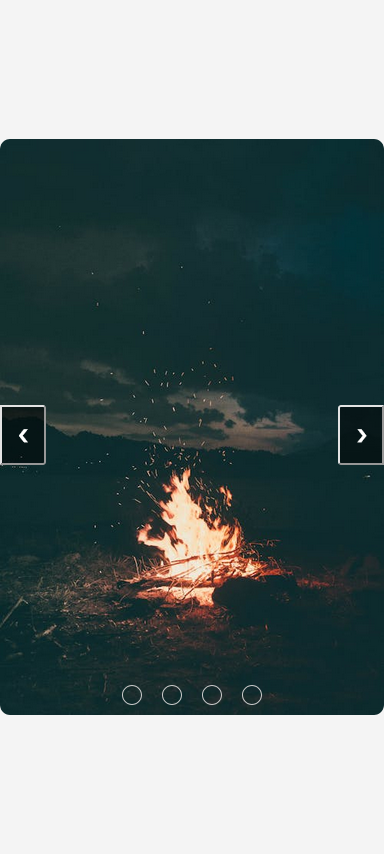

# image-gallery

## Table of contents

- [Overview](#overview)
  - [The challenge](#the-challenge)
  - [Screenshot](#screenshot)
  - [Links](#links)
- [My process](#my-process)
  - [Built with](#built-with)

## Overview

### The challenge

Users should be able to:

- View the optimal layout for the site depending on their device's screen size
- scroll to the next or the previous image
- click on the pagination buttons to navigate to the desired image

### Screenshot

### Links

- Live Site URL: [Landing Page](https://ahmedmekkawy27.github.io/image-gallery/)

## My process

### Built with

- HTML5
- CSS
-javascript

